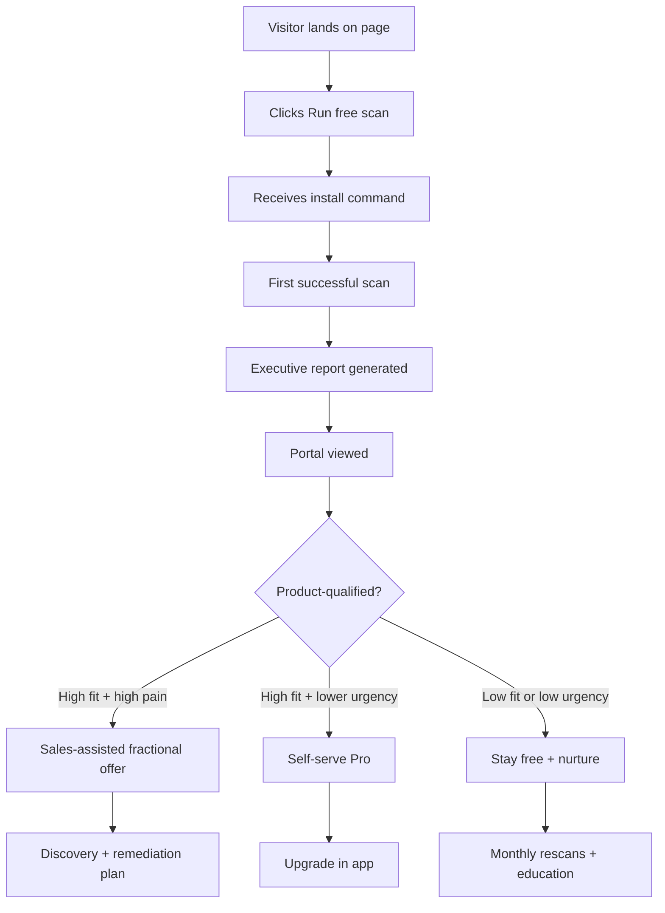
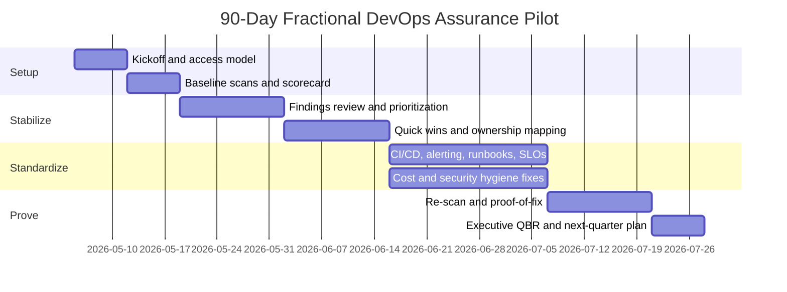

# Fractional DevOps Assurance Growth Blueprint

## Executive summary

The strongest commercial opportunity is **not** “another DevOps dashboard.” It is an **assurance product** for lean B2B SaaS leadership teams that have reached meaningful customer, compliance, and uptime pressure before they have hired a dedicated DevOps/SRE owner. The economic backdrop supports this: startups are hiring more slowly and operating with leaner teams; Carta reports smaller fundraising teams than in 2021, and late-stage startup hiring remains muted. At the same time, engineering organizations report heavy friction, rising toolchain complexity, growing cloud-spend pressure, and meaningful outage costs. That combination creates a specific executive pain: **“I do not know whether our product is operationally ready, but I now have customers, investors, and a board that expect me to know.”** citeturn40view0turn40view1turn40view2turn36view0turn35view0turn37view0turn18view0turn37view3

The best beachhead is **late-seed to Series A B2B SaaS companies with 8–20 engineers, no dedicated DevOps/SRE, one to a few customer-facing products, and an emerging mid-market or enterprise motion**. For this segment, the most valuable problem is not deep telemetry; it is **executive visibility into production readiness, drift, and ownership** across CI/CD, cloud, reliability, security hygiene, cost hygiene, and incident preparedness. entity["company","Amazon Web Services","cloud platform"] already offers a free Well-Architected review mechanism, and platform/IDP vendors such as entity["company","Harness","devops platform"] and entity["company","Port","developer portal"] offer scorecards and portals—but those products assume internal setup effort, a platform owner, or both. Your wedge is the combination they do not offer: **lightweight scanning + executive-grade reporting + optional fractional remediation**. citeturn38view0turn38view1turn33view0turn33view1turn33view2turn33view5

The highest-converting entry point is therefore a **value-first, low-friction free scan**: a read-only CLI that can run monthly or in CI/CD, generating a shareable executive report and a live portal. This structure aligns with product-led research from entity["company","OpenView","venture capital firm"] on low-friction starts and product-qualified leads, with BJ Fogg’s ability/prompt model, with classic small-commitment research, and with onboarding research on endowed progress and goal gradients. It also fits Stanford’s web-credibility guidance: clear evidence, real people, restrained promotion, and easy verification. The landing page should therefore feel **diagnostic, specific, and helpful**, not “salesy.” The product should sell **certainty, evidence, and ongoing stewardship**, not generic “observability.” citeturn19view0turn19view1turn19view2turn16search0turn22view0turn39view0turn39view1turn23view0turn24view3turn24view7turn29view0

## Market thesis and buyer definition

The recommended positioning is:

**Fractional DevOps Assurance** = **continuous production-readiness visibility** for startups that have developers but no DevOps/SRE bench, plus optional expert remediation so leadership can keep the dashboard green without hiring a full-time platform engineer. This matters because the operational pain is increasingly economic and reputational: cloud budgets are overshooting plan, customer-impacting incidents are rising, a meaningful share of outages are seen as preventable, and customers/investors increasingly require proof of operational and compliance maturity. citeturn37view0turn37view1turn18view0turn18view1turn37view2turn37view3

The most important insight is that the **check-writer’s problem and the engineer’s problem are related but not identical**. Engineers feel friction, missing docs, toolchain tax, and deployment drag. The buyer feels uncertainty, slower deals, surprise incidents, cloud-cost anxiety, and fear that a due-diligence questionnaire will expose operational immaturity. The offer should bridge those two worlds with one artifact: a report that turns technical drift into business-readable evidence. citeturn36view0turn35view1turn35view3turn37view1turn33view6

### Ideal customer profile

| Dimension | Best-fit ICP | Why this converts | Evidence |
|---|---|---|---|
| Company stage | Late-seed to Series A B2B SaaS | Lean teams are common; hiring remains disciplined; efficiency pressure is high | citeturn40view0turn40view1turn40view2 |
| Team shape | 8–20 engineers, no dedicated DevOps/SRE, usually one EM/CTO handling ops as a side job | The “ops owner” exists emotionally, but not organizationally; this creates urgent willingness to buy relief | citeturn31view0turn31view1turn36view0 |
| Technical context | Cloud-first, CI/CD in place, some observability already, but inconsistent standards across repos/environments | They do not need raw data; they need normalization, scoring, and remediation guidance | citeturn38view0turn30view2turn33view0turn33view1 |
| Commercial context | Beginning enterprise selling, security review cycles, or uptime-sensitive customers | Buyers increasingly demand proof of compliance and trust; poor operations now blocks revenue | citeturn37view1turn33view4turn33view5 |
| Trigger profile | Recent outage, rising cloud bill, first SOC 2 push, new customer diligence, repeated “who owns production?” confusion | These are moments when assurance becomes budgetable | citeturn37view0turn18view0turn18view1turn37view3 |

### Buyer personas

| Persona | What they want | Main anxieties | Decision criteria | Best triggers | Likely objection | What proof closes them | Evidence |
|---|---|---|---|---|---|---|---|
| CTO | Reliable releases without becoming the accidental SRE | Hidden drift, brittle deployments, unclear ownership, overloaded team | Fast setup, credible methodology, evidence-backed recommendations, low added toil | Recent production incident, customer escalation, scaling traffic | “We already have tools.” | Show that the offer translates existing signals into a prioritized readiness score and explicit owners | citeturn31view1turn35view3turn30view2turn33view0 |
| Founder/CEO | Confidence for customers, investors, and board without another full-time hire | Deal risk, reputation risk, surprise spend, not knowing what “good” looks like | Executive-readable report, trend line, easy sharing, clear upgrade path | Enterprise pipeline, diligence requests, compliance motion | “We are too early.” | Show a free report with plain-English risk and concrete avoided-cost framing | citeturn37view1turn37view0turn18view0turn20search0turn20search1 |
| VP Eng / Head of Eng | Fewer interruptions and better engineering focus | Context switching, friction, toolchain sprawl, no time to standardize | Minimal maintenance, repo/service rollout, backlog prioritization, measurable improvement | Team growth, slower releases, recurring incidents | “This will become another dashboard.” | Show closed-loop workflow: findings → owners → fixes → status trend | citeturn36view0turn35view0turn35view3turn30view2 |

### The pain to sell

The pain to sell is **the assurance gap**:

> “We have enough infrastructure to create risk, but not enough DevOps capacity to continuously verify that risk is under control.”

That pain converts because it combines five already-budgeted executive concerns: preventable outages, cloud-waste pressure, compliance proof, developer inefficiency, and the cost of fragmented tooling. It is more compelling than “better monitoring” because it speaks to **avoidable downside** and **management confidence**, while still producing day-to-day value for engineers. citeturn18view0turn18view1turn37view0turn37view1turn36view0turn35view3

## Offer design and positioning

The offer should be explicitly **two-layered**:

**Layer one: productized assurance.**  
A free scan and portal that surface a monthly or per-commit view of operational readiness.  
**Layer two: fractional execution.**  
A monthly retainer that helps the team remediate, review, and stay green. This is crucial because the underlying market does not just want findings; it wants **ongoing stabilization without a full-time hire**. The differentiator is not “we found 17 issues.” It is “we help you close them.” citeturn31view1turn33view5turn33view6turn37view3

### Recommended packaging

| Package | What it includes | Why it exists | Pricing logic |
|---|---|---|---|
| Free Assurance Scan | Read-only CLI, monthly or CI/CD run, one product/workload, executive report, severity-ranked findings, baseline score, limited history, shareable link, no credit card | Maximum adoption and discovery; creates product-qualified accounts | Keep friction lower than a demo request; this is the small initial commitment that should generate later expansion ethically through delivered value, not pressure | 
| Pro Portal | Scheduled scans, trend history, team seats, Slack/email alerts, policy thresholds, multiple repos/services, remediation workflow, exportable board report | Serves teams that want visibility but not services | Self-serve or sales-assisted depending account size; best as a “monitoring + accountability” layer |
| Fractional DevOps Assurance | Everything in Pro plus monthly review, prioritized remediation plan, office hours, architecture checkups, incident-readiness review, proof-of-fix validation, quarterly game day / failover rehearsal, executive QBR | The real revenue layer; substitutes for delayed platform/SRE hiring | Position well below the cost of a full-time U.S. senior DevOps/platform hire, which Indeed currently places around $151k–$159k base annually before benefits/equity | citeturn20search0turn20search1 |

A sensible first pricing structure is:

- **Free**: $0
- **Pro**: **$499–$999/month** for small teams, priced by workload or service bundle rather than by individual engineer seat
- **Fractional**: **$3,000–$6,000/month**, including Pro portal access and a defined monthly service cadence

That pricing does three things. It maintains an accessible self-serve path, gives a clear “monitor only” alternative for teams not ready for services, and anchors the retainer well below full-time hiring economics. Because buyers often need to justify the purchase upward, a three-tier structure with a clearly recommended middle/upper option works better than a sprawling menu; research on defaults and compromise effects supports this, but choice-overload evidence is mixed, so the real goal is not manipulation—it is **clearer decision-making**. citeturn24view0turn24view9turn28search13turn28search18

### Product promise and proof artifacts

The offer should promise **five outcomes**, not features:

| Promise | What the user sees |
|---|---|
| Know what is broken | Red/yellow/green score by domain and workload |
| Know why it matters | Business-readable impact language tied to reliability, delivery, cost, and trust |
| Know what to do next | Prioritized fixes with owner suggestions and effort estimate |
| Know whether it is improving | Trend line against last scan and rolling history |
| Know you are not alone | Optional monthly expert review and proof-of-fix validation |

This should be framed as **trust, but verify**. Stanford credibility research is especially relevant here: make evidence easy to verify, show the real organization and experts behind the service, make contact easy, design for professionalism and usefulness, show recent updates, use restraint in promotional content, and avoid errors. A product in this category should therefore expose **what it checks, how it checks it, what permissions it needs, when it last scanned, and who reviewed the findings**. citeturn29view0turn21view2

## Landing page architecture and copy

A high-converting, non-salesy page in this category should feel like a **diagnostic brief**, not a pitch deck. The cognitive-science case is straightforward: simple prompts outperform overloaded ones; easier, more readable experiences feel more credible; a small initial ask is more likely to be accepted than an immediate larger ask; progress framing increases completion; and peer-relevant social proof works better than generic puffery. At the same time, too many badges or options can hurt trust or create confusion. citeturn39view1turn39view0turn24view6turn23view0turn24view3turn24view7turn24view4turn21view3turn28search13

### Recommended page structure

| Section | Job to be done | Copy rule | Research basis |
|---|---|---|---|
| Hero | Explain the problem and first step in <10 seconds | One primary CTA, one secondary CTA, concrete outcome | citeturn39view1turn39view0 |
| “What the free scan checks” | Reduce ambiguity | Be specific about checks, permissions, and output | citeturn29view0 |
| Sample executive report | Create tangible credibility | Show real artifact, not abstract promise | citeturn29view0turn21view2 |
| “Why teams upgrade” | Clarify self-serve vs service | Emphasize continuity and accountability, not pressure | citeturn19view0turn19view1 |
| Social proof / proof block | Reduce perceived risk | Use exact logos, exact counts, expert bios, or methodology; never fake “trust” | citeturn29view0turn21view3 |
| Pricing cue | Make choice legible | Three options max, recommended option, plain-language “who it is for” | citeturn24view0turn24view9turn28search13 |
| FAQ | Handle hidden objections | Answer install, access, false positives, and “already have tools” | citeturn29view0 |

### Recommended hero copy

**Headline**  
**See your DevOps blind spots before customers do.**

**Subhead**  
Run a free read-only CLI scan monthly or in CI/CD. Get an executive-ready report on release safety, reliability, security hygiene, cloud cost risk, and ownership gaps—plus clear next steps to get back to green.

**Primary CTA**  
**Run free scan**

**Secondary CTA**  
**See sample executive report**

**Trust microcopy under CTA**  
Read-only • No agent • No credit card • Works monthly or in CI/CD

This hero works because it combines a concrete downside (“before customers do”) with a clear, low-effort starting behavior and a specific artifact. It is assertive without sounding pushy because the ask is diagnostic, not contractual. citeturn39view0turn39view1turn23view0turn29view0

### Recommended section copy snippets

**Outcome strip**
- Know your production-readiness score
- See drift before it becomes downtime
- Share one report with your CTO, founder, or board
- Upgrade only if you want ongoing help keeping it green

**What the scan checks**
- CI/CD safety and rollback readiness  
- Observability and alert coverage  
- Reliability controls and ownership gaps  
- Secrets, access, and change hygiene  
- Cost and environment sprawl signals  
- On-call, runbook, and recovery maturity

**Upgrade explanation**
- **Pro** is for teams that want continuous monitoring and trend history.  
- **Fractional** is for teams that also want a monthly expert partner to review, prioritize, and help close gaps.

**Soft social-proof line when you have early traction**
- Used by lean SaaS teams shipping fast without a dedicated SRE.

Use the last line only once you can back it with a true numerator or logos. If you do not have customer logos yet, the proof block should lean on methodology, expert reviewers, sample reports, recent-scan counts, and precise access/security explanations instead. Stanford’s credibility guidance and field research on trust cues both suggest that **specific, verifiable trust signals** outperform noisy or excessive badge clutter. citeturn29view0turn21view3

### Sample landing page HTML

```html
<!doctype html>
<html lang="en">
<head>
  <meta charset="utf-8" />
  <title>DevOps Assurance</title>
  <meta name="viewport" content="width=device-width, initial-scale=1" />
</head>
<body>
  <header>
    <nav>
      <a href="/">DevOps Assurance</a>
      <a href="#sample-report">Sample report</a>
      <a href="#pricing">Pricing</a>
      <a href="#faq">FAQ</a>
      <a href="#cta">Run free scan</a>
    </nav>
  </header>

  <main>
    <section id="hero">
      <h1>See your DevOps blind spots before customers do.</h1>
      <p>
        Run a free read-only CLI scan monthly or in CI/CD. Get an executive-ready
        report on release safety, reliability, security hygiene, cloud cost risk,
        and ownership gaps—plus clear next steps to get back to green.
      </p>
      <p>
        <a href="#cta">Run free scan</a>
        <a href="#sample-report">See sample executive report</a>
      </p>
      <small>Read-only • No agent • No credit card • Works monthly or in CI/CD</small>
    </section>

    <section id="checks">
      <h2>What the free scan checks</h2>
      <ul>
        <li>CI/CD safety and rollback readiness</li>
        <li>Observability and alert coverage</li>
        <li>Reliability controls and ownership gaps</li>
        <li>Secrets, access, and change hygiene</li>
        <li>Cost and environment sprawl signals</li>
        <li>On-call, runbook, and recovery maturity</li>
      </ul>
    </section>

    <section id="sample-report">
      <h2>Get a report your CTO and founder will actually read</h2>
      <p>
        One score. Top risks. Business impact. Recommended fixes. Trend versus last scan.
      </p>
    </section>

    <section id="pricing">
      <h2>Start free. Upgrade only if you want more coverage or hands-on help.</h2>

      <article>
        <h3>Free Assurance Scan</h3>
        <p>Monthly scan, one workload, executive report, limited history.</p>
      </article>

      <article>
        <h3>Pro Portal</h3>
        <p>Scheduled scans, alerts, trend history, collaboration, exports.</p>
      </article>

      <article>
        <h3>Fractional DevOps Assurance</h3>
        <p>Portal included, monthly review, remediation guidance, ongoing support.</p>
      </article>
    </section>

    <section id="faq">
      <h2>FAQ</h2>
      <details>
        <summary>Do I need to install an agent?</summary>
        <p>No. The scan is read-only and can run via CLI or CI/CD.</p>
      </details>
      <details>
        <summary>Will this replace our observability stack?</summary>
        <p>No. It turns scattered signals into a readiness score and action plan.</p>
      </details>
      <details>
        <summary>What if we already use Datadog or Grafana?</summary>
        <p>Great. We use your existing setup as evidence, not as something to rip out.</p>
      </details>
    </section>

    <section id="cta">
      <h2>Run your free scan</h2>
      <form>
        <label>Email <input type="email" /></label>
        <button type="submit">Send install command</button>
      </form>
    </section>
  </main>
</body>
</html>
```

## Conversion funnel and lifecycle design

The funnel should be **product-led at the front, sales-assisted after credible product intent**. That is important because OpenView’s work shows that users increasingly discover and start with product experience, while product-qualified leads convert far better than traditional top-of-funnel leads. The free motion should therefore optimize for first value; sales should focus on accounts that have already demonstrated need, fit, and organizational pull. citeturn19view2turn19view1turn16search0turn16search4



### Activation design

The activation milestone should not be “account created.” It should be:

**Activation = first successful scan + report viewed + one finding understood**

That is more defensible than vanity signups and is consistent with the distinction OpenView draws between activation and downstream qualification. A good onboarding sequence should compress **time-to-first-report**, not simply grow the user database. citeturn19view1turn19view2

### Recommended onboarding checklist

Use a short checklist with obvious progress:

1. Account created  
2. First scan run  
3. Report opened  
4. Invite one teammate  
5. Connect CI/CD or schedule monthly run  
6. Mark one finding as reviewed

Do not bury the user in settings. Endowed-progress and goal-gradient research support giving users a visible head start and a short path to completion; the checklist should default to **already having one step complete** at signup. citeturn24view3turn24view7

### Product signals for outreach

Sales should reach out only when the user has shown both **fit** and **friction**:

| Signal | Why it matters |
|---|---|
| First successful scan from a company-domain email | Basic intent and technical activation |
| Report opened multiple times or shared | Executive/internal relevance |
| Scan score below threshold or repeated red findings | High pain |
| Second repo / second service added | Expansion intent |
| CI/CD integration set up | Operational seriousness |
| Founder, CTO, or VP Eng invited | Multi-threading and budget path |
| Diligence pack / security FAQ viewed | Buying-context indicator |

These are the equivalent of product-qualified signals, and they should drive the CRM handoff. For a technical product, that is materially better than SDR outreach based on whitepaper downloads. citeturn16search0turn16search4

### Recommended email sequence

**Email one — immediately after signup**  
Subject: Your free DevOps assurance scan is ready to run

Hi {{first_name}},

You can run your first scan in a few minutes.

It is read-only, works in CI/CD or from your terminal, and generates one executive-ready report covering release safety, reliability, security hygiene, cost risk, and ownership gaps.

**Install command:**  
`curl -fsSL ... | bash`

What you will get after the first run:
- overall readiness score
- top risks by severity
- business-readable summary
- recommended next fixes

If you would rather look first, here is a sample report: {{sample_report_link}}

— {{sender}}

**Email two — after first scan completes**  
Subject: Your first report is live

Hi {{first_name}},

Your first scan found **{{n}} high-priority items** and **{{m}} medium-priority items**.

The most important takeaway:
**{{top_risk_summary}}**

Open your report here: {{report_link}}

If you want, reply to this email and I will send back a 3-bullet interpretation for leadership language.

— {{sender}}

**Email three — soft upgrade trigger**  
Subject: Want us to keep this green for you?

Hi {{first_name}},

You now have a baseline. The next question is whether you want to manage the findings yourself or have us review them with you each month.

Most teams choose one of two paths:
- **Pro portal** for continuous scans, alerts, and trend tracking
- **Fractional DevOps assurance** for monthly review, remediation guidance, and ongoing support

If useful, I can send a one-page comparison.

— {{sender}}

This sequence remains non-salesy because the first two emails are entirely value-delivery and interpretation. The third email is conditional and framed around decision support, not pressure. That fits Stanford’s guidance to be clear, direct, and sincere, and it respects the fact that the first contact should support a simple next behavior rather than pack too much into one ask. citeturn29view0turn39view1

### KPI stack

| Funnel stage | Primary KPI | Good early target | Why it matters |
|---|---|---|---|
| Visitor → signup | Landing page visitor-to-signup rate | 3–6% directional starting range | OpenView reports ~6% for freemium and ~3–4% for free trial across broader SaaS; use as direction, not a rigid benchmark | citeturn19view2 |
| Signup → first scan | Activation rate | 25–40% | Time-to-first-value is the real bottleneck |
| First scan → report view | Report open rate | 70%+ | Confirms output is meaningful |
| Report view → teammate invite | Multi-thread rate | 20–30% | Indicates org relevance |
| Free → PQL | PQL rate | Define internally | Convert based on fit + pain + engagement |
| PQL → paid | PQL conversion | 15–30% directional | OpenView reports PQLs often convert at 15–30% and at materially higher rates than general conversion | citeturn16search0turn16search4 |
| Free → Pro | Self-serve conversion | 2–5% early target | Should be lower than service conversion if value lands at leadership level |
| Free/PQL → fractional | Sales-assisted conversion | 10–20% of qualified accounts | Higher-ACV motion |
| Retention | Monthly rescan rate | 60%+ | The product must become a recurring operational ritual |
| Outcome | % high-priority findings closed in 90 days | 50%+ | This is the strongest proof of value |

## Fractional service pilot and SLA

The service should be positioned as **an assurance operating cadence**, not generic “consulting hours.” Buyers need to understand exactly what happens each month and exactly what response behavior they are buying. Google’s SRE material is helpful here: the point of operational support is not endless interrupts; it is reducing overload, addressing repetitive toil, improving design and production readiness early, and maintaining a healthy balance between operations and engineering work. citeturn31view0turn31view1



### Recommended pilot scope

| Week range | Deliverable |
|---|---|
| First two weeks | Baseline scan, top-risk review, ownership map, prioritized backlog |
| First month | Quick wins closed, false-positive tuning, CI/CD scheduling enabled |
| First two months | Reliability hygiene improvements, alert/runbook/on-call fixes, cost/security drift review |
| First three months | Re-score, proof-of-fix summary, executive QBR, next-quarter roadmap |

### Recommended SLA

| Area | Standard SLA |
|---|---|
| Monthly findings review | Completed within 5 business days of scheduled scan |
| High-severity item triage | Initial response within 1 business day |
| Medium-severity item triage | Initial response within 3 business days |
| Portal/report freshness | Updated within 24 hours of successful scan |
| Monthly advisory session | 60–90 minutes included, with notes and action log |
| Emergency advisory | Optional add-on; do not overpromise 24/7 unless you are truly staffed for it |
| Proof-of-fix validation | Included for items closed during the monthly cycle |

Keep the SLA conservative and credible. This category is fundamentally trust-sensitive; over-promising response behavior is one of the fastest ways to destroy credibility. citeturn29view0turn31view0

## Pricing, objections, and competitive position

### Packaging recommendation

Position the choices like this:

| Plan | Positioning copy | Suggested price |
|---|---|---|
| Free Assurance Scan | “See where you stand.” | $0 |
| Pro Portal | “Keep a continuous eye on operational drift.” | $499–$999/mo |
| Fractional DevOps Assurance | “Get ongoing monitoring plus a monthly expert partner to keep it green.” | $3k–$6k/mo |

The pricing cue should not lead with features. It should lead with **buyer self-selection**: “for teams exploring,” “for teams that want continuous monitoring,” “for teams that want someone to review and help close gaps every month.” That reduces justification friction and supports the compromise/default effect without making the page feel manipulative. citeturn24view0turn24view9

### Objection-handling scripts

**We already use observability tools.**  
That is exactly why this should be easy to try. We are not replacing your stack. We turn your current setup, plus your CI/CD and cloud configuration, into a single readiness score, executive report, and remediation workflow. Your tools tell you a lot. They do not usually tell leadership whether the whole operating picture is trending safer or riskier. citeturn34view0turn34view1turn30view2

**We are too early.**  
If you do not yet have deploy risk, customer diligence, or cloud-spend anxiety, stay on the free plan. This is for the moment when “we should probably tighten this up” becomes “someone now expects evidence.” The free scan exists so you can verify whether you are there yet. citeturn37view1turn37view0turn38view1

**This sounds like another dashboard.**  
Dashboards are not the product. The product is the monthly answer to four questions: what changed, what is risky, who owns it, and did it get better? If that loop is not present, it is just another dashboard. citeturn33view0turn33view1turn30view2

**We will just hire later.**  
That is reasonable. The retainer exists to buy you time and lower risk until that hire is justified. It should be easy to cancel, easy to hand off, and cheaper than carrying a full-time senior DevOps/platform salary before you need one. citeturn20search0turn20search1

**We cannot install agents or grant broad access.**  
Then do not. The free product should be read-only and transparent about scope. Publish exactly what the CLI checks, what permissions it uses, and what it does not do. In a trust-sensitive category, access clarity is part of the product itself. citeturn29view0

### Competitive positioning

| Competitor / category | What they do well | Where they fall short for this ICP | Position against them |
|---|---|---|---|
| entity["company","Datadog","observability company"] | Deep infrastructure/application observability; broad coverage; strong telemetry | Host-based pricing and product breadth can outpace a small team’s operating maturity; still requires interpretation and ownership | “Use your telemetry as evidence, then translate it into readiness and action.” citeturn34view0turn30view2 |
| entity["company","Grafana Labs","observability company"] | Strong free tier; self-serve path; unified observability | Excellent for visibility, but the buyer still must define standards, score maturity, and drive remediation | “We sit above raw observability and tell leadership what matters now.” citeturn34view1 |
| entity["company","PagerDuty","incident response platform"] / entity["company","incident.io","incident management platform"] | Strong incident response and on-call workflows | Primarily reactive; helps when things go wrong, not necessarily before readiness drift accumulates | “We reduce preventable risk before it turns into an incident.” citeturn15search0turn34view2turn37view3 |
| AWS Well-Architected | Free structured review; concrete cloud best practices | AWS-centric; periodic review, not a cross-tool assurance motion with optional fractional follow-through | “We operationalize the review, add recurrence, reporting, and remediation.” citeturn38view0turn38view1 |
| Port / Harness IDP & scorecards | Strong portals, scorecards, templates, developer self-service | Better fit when a platform team exists to own modeling and governance | “Same need for standards, lower setup burden, plus expert follow-through.” citeturn33view0turn33view1turn33view2 |
| entity["company","Vanta","compliance company"] / entity["company","Drata","compliance company"] | Continuous compliance/trust monitoring; useful for audits and trust centers | Solve compliance visibility, not production-readiness, CI/CD hygiene, or ops ownership gaps | “We complement trust/compliance by proving the product can operate safely.” citeturn33view4turn33view5turn33view6turn37view1 |

The white space is therefore clear: **continuous operational assurance for lean SaaS teams that lack a platform owner**. The category is adjacent to observability, incident response, IDPs, and compliance automation, but it should not position itself as a replacement for any of them. It is the **executive and operational layer across them**. That is both more credible and easier to adopt. citeturn34view0turn34view1turn34view2turn33view5turn33view6

## Experiments, dashboard, and open questions

### Recommended A/B tests

| Test | Variant A | Variant B | Success metric | Why it matters |
|---|---|---|---|---|
| Hero framing | “See your blind spots before customers do” | “Get a free monthly DevOps assurance report” | Visitor-to-signup | Tests sharper pain language vs calmer assurance language |
| CTA text | Run free scan | Get free report | CTA CTR and activation | Separates action-first from artifact-first intent |
| Secondary CTA | See sample report | How the scan works | Signup assist rate | Some buyers need proof artifact; others need security clarity |
| Proof block | Expert bio + methodology | Customer logos + methodology | Signup rate and bounce | Early-stage trust source may differ depending on traction |
| Pricing display | Show all three tiers | Show Free + “Compare plans” | Free signup and paid intent | Too much pricing too early may suppress top-funnel volume |
| Onboarding | Single install step | Install + schedule prompt | First-scan activation | Measures where friction really sits |
| Progress UI | Checklist only | Checklist + progress bar | Activation completion | Tests endowed-progress effect in your context |

### Metrics dashboard

Your internal dashboard should combine **funnel metrics**, **product health**, and **outcome metrics**:

| Dashboard slice | Core measures |
|---|---|
| Acquisition | Visitors, CTA CTR, signup by channel, signup by page variant |
| Activation | Time to first scan, scan success rate, report view rate, checklist completion |
| Qualification | PQL count, PQL rate, PQL by ICP fit, sales-accepted PQLs |
| Revenue | Free→Pro, Free→Fractional, PQL→paid, ACV, payback period |
| Retention | Monthly rescan rate, multi-seat invite rate, second workload added, churn |
| Outcome | High-severity findings closed, readiness score trend, customer-reported incident count, DORA trend where available |
| Service | SLA attainment, review completion time, proof-of-fix turnaround, QBR completion |

Use the DORA metrics as downstream “customer value proof,” not as the only product KPI. The core promise of the product is assurance and reduced uncertainty; the operational proof is whether deployment safety, recovery, and instability improve over time. citeturn30view2turn30view1

### Open questions and limitations

This report is high-confidence on the **market logic, positioning, and funnel design**, but it still has three important limitations. First, the landing-page copy and pricing should be validated with **10–15 buyer interviews** and a live fake-door or concierge pilot, because willingness to pay in this category will vary by recent pain event and customer segment. Second, broader PLG benchmarks from OpenView are useful directionally, but they are not a perfect proxy for a hybrid developer-tool plus fractional-service offer. Third, the strongest eventual moat will likely come from proprietary remediation data and scan-to-outcome benchmarks, which public sources cannot supply. citeturn22view1turn22view2turn19view2turn16search0